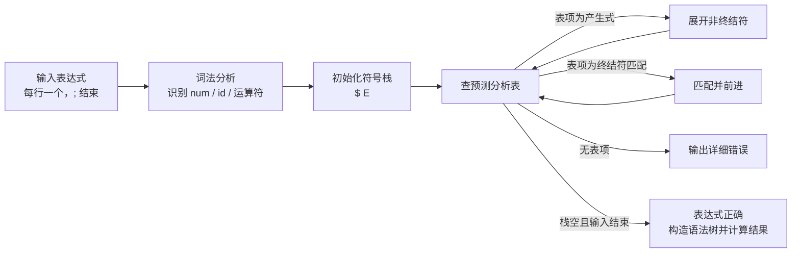

# 算术表达式 LL(1) 可视化

## 1. 文法改写

```mermaid
flowchart TD
    A[原始文法\nE -> E + T | T\nT -> T * F | F\nF -> (E) | i] --> B[消除左递归]
    B --> C[LL(1) 文法\nE -> T E'\nE' -> + T E' | - T E' | ε\nT -> F T'\nT' -> * F T' | / F T' | ε\nF -> ( E ) | num | id]
```

## 2. 预测分析流程



## 3. 示例语法树

```mermaid
flowchart TD
    E[E]
    E --> T1[T]
    E --> E1[E']

    T1 --> F1[F]
    T1 --> T1p[T']
    F1 --> N1[num(1)]
    E1 --> P1[+]
    E1 --> T2[T]
    E1 --> E2[E']
    T2 --> F2[F]
    T2 --> T2p[T']
    F2 --> N2[num(2)]
```

## 4. 使用方式

在 VS Code 中打开此文件并使用 Markdown 预览，即可直接看到图形化结果。

如果你希望，我还可以继续把 `output.txt` 中的分析过程整理成“逐步动画式”的图表版本。